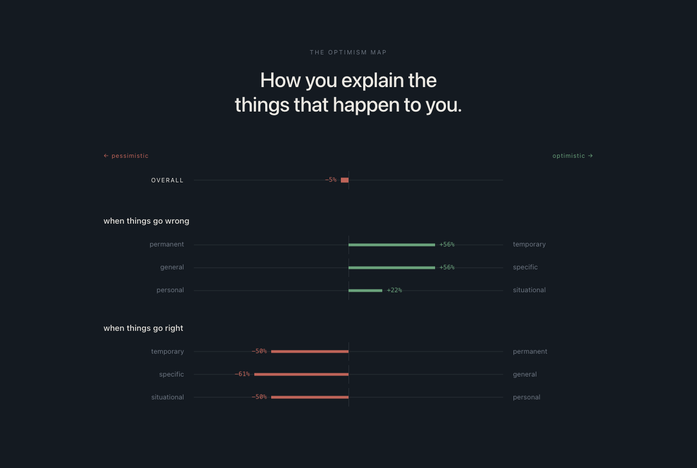

# positive-psychology

Skills for Claude Code and Codex, built on what positive psychology can
actually measure.

A skill is a folder of instructions you drop into Claude, and usually that
is all it is. It follows a new architecture where a skill is an app. This
one has its own user interface, database and backend service, along with its
instructions, and all of them together drive the model to train optimism.

---

# learn-optimism

You missed a deadline. Before you've finished noticing, you've already told
yourself why.

That sentence is the thing this measures.

Someone who missed a deadline can explain it two ways.

> *I always leave things too late.*
>
> *I left that one too late.*

The first has no end in it, so there's nothing to fix and nothing to do
differently tomorrow. The second one already finished, which leaves you a
next deadline to plan for.

Same event, same person, two different tomorrows.

Most people lean one way without noticing, and that lean is what Martin
Seligman's research ties to how well people keep going after things go
wrong. Psychologists call it explanatory style, and they ask three things
about any reason you give. Does it last? How far does it spread? Is it you,
or the situation?

So optimism here isn't a mood you talk yourself into. It's a habit of
explanation, it runs in sentences you already say, and it can be measured in
them.

You tell it, in chat, what actually happened to you. It finds the reason you
gave, stores that sentence word for word, and scores it. The terminology
comes later, once you can already hear the difference.

## The app



| Part | What it does |
|---|---|
| **The database** | Every sentence you've given it, word for word. Every question it has asked and how you answered. How far you've got with each idea it teaches |
| **The backend service** | Reads the database and works out your current scores, plus which way they've moved once there's enough history to compare against |
| **The user interface** | The picture above: your result in a sentence, a bar for each of the three questions, and what you're practising |
| **The instructions** | How to score a sentence, what to ask next, and how to say it so it sounds like a person |

`/learn-optimism` starts the skill as an app, and it continues from where
you left off, across any session.

A pattern across twelve sentences is hard to see from inside the
conversation that produced them, which is what the page is for. It's read
only, and for now you interact with the app through chat, while the page
keeps itself up to date every few seconds.

## How the teaching works

### It listens before it teaches you anything

For your first twelve stories it teaches you nothing. Six things that went
wrong, six that went right, and it reflects each one back to you as you go.

### Every question comes from something you actually lived

It reads back through everything you've told it, picks one thing to work on,
and builds the question out of one of your own events. One will ask what
you'd do about the next deadline, and only your memory of the last one can
answer that.

### You answer in your own words

You write a sentence back. That sentence shows whether you heard the
difference, which is how it grades you, and a full one joins your file as
material for a later question. Your scores read only what you volunteered
before any coaching.

### Sessions are short on purpose

Two or three questions, each waiting on your answer, then it stops for the
day.

### Your scores follow your latest six

Only your six most recent setbacks and six most recent wins count. The part
worth watching is the distance between them: how you explain the bad ones
against how you explain the good ones.

## Install

The repo is a plugin marketplace, so Claude Code can install it directly:

```
/plugin marketplace add sirajfarhan/positive-psychology
/plugin install positive-psychology@positive-psychology
```

Codex reads the same folder, and both tools share the one database. You'll
need `python3` and `node`, and the app builds the rest of itself the first
time it runs. Say `/learn-optimism` and it opens with one question.

## The database

An app that measures you over months has to outlive its own installs, so the
database sits outside the plugin, where your operating system keeps things
like it.

| | |
|---|---|
| macOS | `~/Library/Application Support/positive-psychology/` |
| Linux | `~/.local/share/positive-psychology/` |
| Windows | `%LOCALAPPDATA%\positive-psychology\` |

It survives every install, update and removal. If an older version kept your
file elsewhere, it brings it along on the first run. Ask it where anything
ended up and it'll tell you.

The file updates itself on the next run and keeps a dated copy of the old
one, however old the version you're coming from.

## Where it stops

It scores the explanation you gave for an event, and that's the whole of
what it does. When something heavier than an explanation comes up, it stops,
says so, and points you at real help instead of scoring it or arguing with
it.

## How far to trust it

The model does the scoring itself, working from example sentences written
for this skill. Nobody has checked whether a second rater would agree, and
there's no baseline from other people to compare you against. Trust the
direction, the gap between how you tell the bad ones and how you tell the
good ones, and the change against your own history. Don't trust the number
itself, and don't compare it to anyone.

More skills can drop in beside this one, each with its own four parts, and
everything above stays true for each of them.